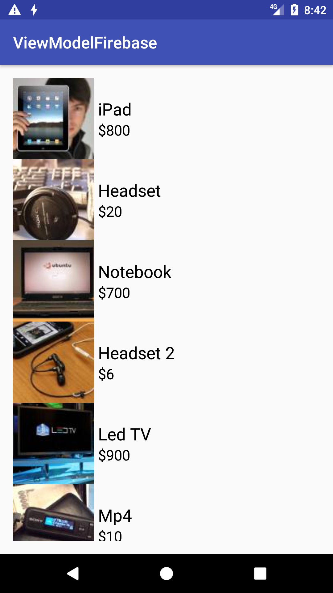
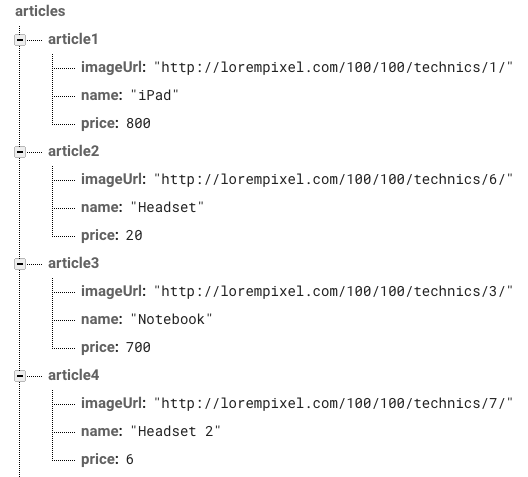

# viewmodel-firebase-sample

Simple app to show ViewModel and Firebase Database working together.

### Note
Keep in mind when you compile the project, you need a valid google-services.json in app module. To do that, you can create your own firebase database with the following format:

